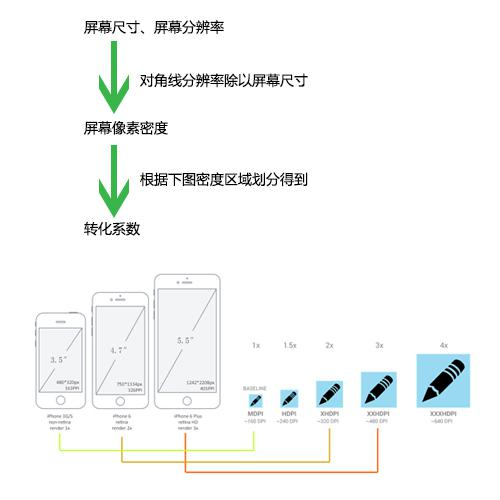

### css基本度量单位

##### 绝对长度

绝对长度单位：in（inch英寸）、cm（厘米）、mm（毫米）、pt（磅）、pc（pica）。

in、cm、mm和实际中的常用单位完全相同，pt是标准印刷上常用的单位，72pt的长度为1英寸。pc也是印刷上用的单位，1pc的长度为12磅。

在```w3c``` 绝对大小值只有7个值，就是平常我们很少用到的那些英文数值 xx-small，x-small，small，medium，large，x-large，xx-large这7个绝对值。

##### 相对长度

相对长度单位：是网页设计中使用最多的长度单位，包括px(PC)、em、rem(Mobule)等。

##### 屏幕尺寸

屏幕尺寸：指屏幕的对角线的长度，单位是英寸，1英寸=2.54厘米。

常见的屏幕尺寸有3.5(iphone4)、4.7（iphone6）、5.0、5.5(iphone6 plus)、6.0等。

##### 屏幕分辨率

屏幕分辨率：指在横纵向上的像素点数，单位是px，1px=1个像素点。一般以纵向像素*横向像素来表示一个手机的分辨率，如1960x1080。（这里的1像素值得是物理设备的1个像素点）

##### 屏幕像素密度

屏幕像素密度：屏幕上每英寸可以显示的像素点的数量，单位是ppi，即pixels per inch的缩写。

屏幕像素密度与屏幕尺寸和屏幕分辨率有关，在单一变化条件下，屏幕尺寸越小、分辨率越高，像素密度越大，反之越小。

##### 计算像素密度的公式

勾股定理算出对角线的分辨率：√(1920²+1080²)≈2203px （1920*1080为分辨率）
对角线分辨率除以屏幕尺寸：2203/5≈440dpi。（5为屏幕尺寸）

#### ppi、dpi、dp、dip、sp、px

ppi：pixels per inch，屏幕上每英寸可以显示的像素点的数量，即屏幕像素密度。

dpi：dots per inch，最初用于衡量打印物上每英寸的点数密度，就是打印机可以在一英寸内打多少个点。当dpi的概念用在计算机屏幕上时，就称之为ppi。ppi和dpi是同一个概念，Android比较喜欢使用dpi，IOS比较喜欢使用ppi。

dp、dip：dp和dip都是Density Independent Pixels的缩写，密度独立像素，可以想象成是一个物理尺寸，使同样的设置在不同手机上显示的效果看起来是一样的

px：就是通常所说的像素，使网页设计中使用最多的长度单位。将显示器分成非常细小的方格，每个方格就是一个像素。（网页重构中使用的px和屏幕分辨率的px不一定是一样的大小。）

依靠分辨率和屏幕尺寸计算到的屏幕像素密度，再看屏幕像素密度属于哪个系数等级。




### rem

##### 基本概念

rem（font size of the root element）是指相对于根元素的字体大小的单位。

em（font size of the element）是指相对于父元素的字体大小的单位。

它们之间其实很相似，只不过一个计算的规则是依赖根元素一个是依赖父元素计算。

##### web app的屏幕适配方案

1、流式布局

他们在页面布局的时候都是通过百分比来定义宽度，但是高度大都是用px来固定住，所以在大屏幕的手机下显示效果会变成有些页面元素宽度被拉的很长，但是高度还是和原来一样，实际显示非常的不协调，这就是流式布局的最致命的缺点。

流式布局并不是最理想的实现方式，通过大量的百分比布局，会经常出现许多兼容性的问题，还有就是对设计有很多的限制。

亚马逊、携程就是采用这样布局。

2、固定宽度做法

就是固定页面宽度的做法，在大屏幕手机下两边是留白的，还有一个就是大屏幕手机下看起来页面会特别小，操作的按钮也很小，手机淘宝首页起初是这么做的，但近期改版了，采用了rem。

3、响应式做法

响应式这种方式在国内很少有大型企业的复杂性的网站在移动端用这种方法去做，主要原因是工作大，维护性难。

4、设置viewport进行缩放

天猫的web app的首页就是采用这种方式去做的，以320宽度为基准，进行缩放，最大缩放为320*1.3 = 416，基本缩放到416都就可以兼容iphone6 plus的屏幕了，这个方法简单粗暴，又高效。

5、rem能等比例适配所有屏幕

上面说过rem是通过根元素进行适配的，网页中的根元素指的是html我们通过设置html的字体大小就可以控制rem的大小。

##### 常规情况下js根据屏幕宽度动态计算
```code
!(function(doc, win) {
    var docEle = doc.documentElement,
        evt = "onorientationchange" in window ? "orientationchange" : "resize",
        fn = function() {
            var width = docEle.clientWidth;
            width && (docEle.style.fontSize = 20 * (width / 320) + "px");
        };
     
    win.addEventListener(evt, fn, false);
    doc.addEventListener("DOMContentLoaded", fn, false);
 
}(document, window));
```


#### 媒体查询较密集的断点
```code
@media screen and (min-width: 320px) {
    html {font-size: 14px;}
}
 
@media screen and (min-width: 360px) {
    html {font-size: 16px;}
}
 
@media screen and (min-width: 400px) {
    html {font-size: 18px;}
}
 
@media screen and (min-width: 440px) {
    html {font-size: 20px;}
}
 
@media screen and (min-width: 480px) {
    html {font-size: 22px;}
}
 
@media screen and (min-width: 640px) {
    html {font-size: 28px;}
}
```

### 参考链接

<a href="http://tgideas.qq.com/webplat/info/news_version3/804/7104/7106/m5723/201509/376281.shtml" target="_blank">深入了解viewport和px</a>

<a href="http://isux.tencent.com/web-app-rem.html" target="_blank">web app变革之rem</a>

<a href="http://www.html-js.com/article/2400" target="_blank">关于webapp中的文字单位的一些捣腾</a>